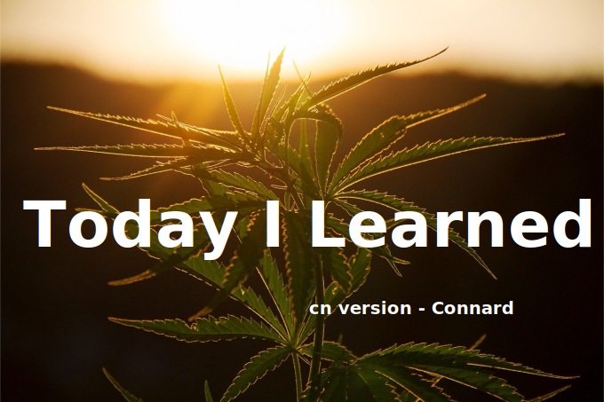

# cnTIL

## What is this?

This repo idea comes from github project [TIL](https://github.com/topics/today-i-learned)

When I read this from [Josh Branchaud](https://github.com/jbranchaud)

>I came out of the audition with a ton of notes -- small things I had picked up while pairing with different members of the team. As I anxiously awaited to hear back, I felt this desire to continue to prove myself and I didn't want to lose track of what I had learned. So, I started writing up short, to-the-point microblogs about the different things I had learned. I started collecting these in a GitHub repository and indexed all of it with a README.

I think what you writing is not important, the essential point is to keep notes taking.

So here is my TIL project on the way.

## Contact

Any issues please contact [Me:)](mailto:admin@lovelacelee.com)